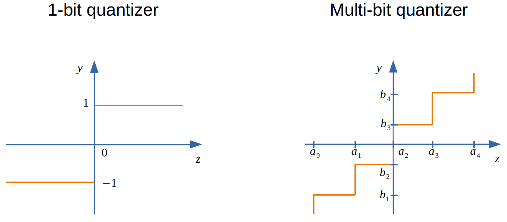
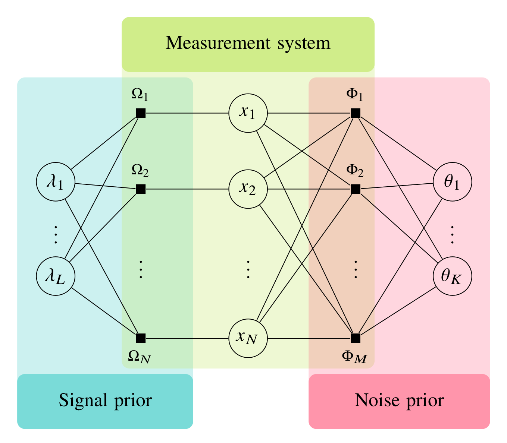

# 1-bit and Multi-bit Compressive Sensing via AMP with Parameter Estimation
* `1-bit Compressive Sensing` (CS) tries to recover a sparse signal from quantized 1-bit measurements.
* `1-bit CS` can be straightforwardly extended to `multi-bit CS` that tries to recover a sparse signal from quantized multi-bit measurements.
* We propose to solve the two problems using the proposed `AMP with built-in parameter estimation` (**AMP-PE**) [1].
* AMP-PE offers a much simpler way to estimate the distribution parameters, which allows us to directly work with true quantization noise models.
{width=100%}

* This package contains code files to implement the approach described in the following paper.
```
@article{QM_AMP_PE,
    author={Shuai Huang and Deqiang Qiu and Trac D. Tran},
    journal={IEEE Transactions on Signal Processing}, 
    title={Approximate Message Passing With Parameter Estimation for Heavily Quantized Measurements}, 
    year={2022},
    volume={70},
    number={},
    pages={2062-2077},
    doi={10.1109/TSP.2022.3167516}
}
```
If you use this package and find it helpful, please cite the above paper. Thanks :smile:
{width=50%}


## Summary
```
    ./src          -- This folder contains MATLAB files to recover the signal from 1-bit and multi-bit measurements.
    ./demo         -- This folder contains demo files to run experiments in the paper, detailed comments are within each demo file.
```
## Usage

AMP-PE adopts the GAMP formulation [2] to perform message passing. 

You can follow the following steps to run the program. Detailed comments are within each demo file.


Open `MATLAB` and type the following commands into the console:

* Step 1) Recover the signal from noisy 1-bit, 2-bit and 3-bit measurements.
```
    >> addpath(genpath('./'))
    >> % nonzero entries of the signal follow Gaussian distribution
    >> noisy_recovery_1bit_scalar_gaussian
    >> noisy_recovery_2bit_scalar_gaussian
    >> noisy_recovery_3bit_scalar_gaussian
    >>
    >> % nonzero entries of the signal follow Cauchy distribution
    >> noisy_recovery_1bit_scalar_cauchy
    >> noisy_recovery_2bit_scalar_cauchy
    >> noisy_recovery_3bit_scalar_cauchy
    >>
    >> % nonzero entries of the signal follow Laplace distribution
    >> noisy_recovery_1bit_scalar_laplace
    >> noisy_recovery_2bit_scalar_laplace
    >> noisy_recovery_3bit_scalar_laplace
```
* Step 2) Perform State Evolution (SE) analysis of the proposed AMP-PE approach.
```
    >> addpath(genpath('./'))
    >> noisy_SE_1bit
    >> noisy_SE_2bit
    >> noisy_SE_3bit
```
* Step 3) Run the channel estimation experiments.
```
    >> addpath(genpath('./'))
    >> noisy_channel_estimation_1bit
    >> noisy_channel_estimation_2bit
    >> noisy_channel_estimation_3bit
```


## Reference

[1] S. Huang and T. D. Tran, "Sparse signal recovery using generalized approximate message passing with built-in parameter estimation," in Proceedings of IEEE ICASSP, March 2017, pp. 4321–4325.

[2] S. Rangan, "Generalized approximate message passing for estimation with random linear mixing," in Proceedings of IEEE ISIT,  July 2011, pp. 2168–2172.
